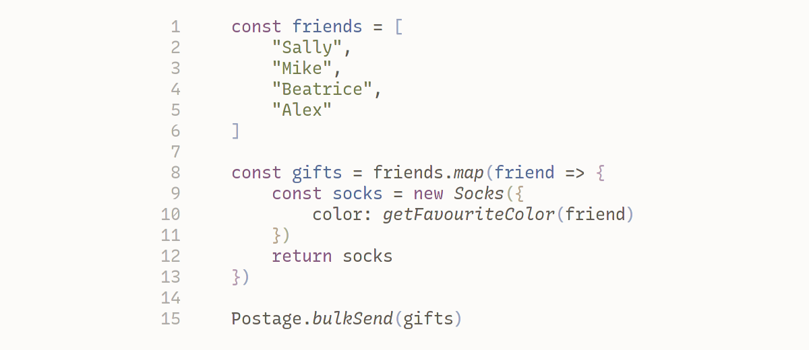
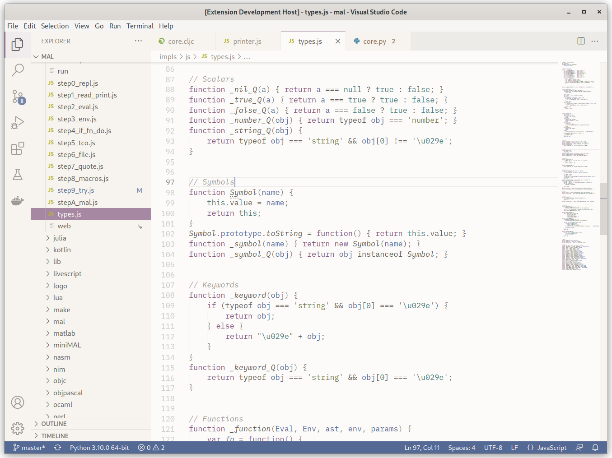

# Earl Grey

A gentle color scheme, for (visual studio) code.

Website: https://earl-grey.halt.wtf

On the Visual Studio Code Marketplace: https://marketplace.visualstudio.com/items?itemName=EarlGrey.earl-grey





## Installation

In Visual Studio Code, open the command pallette (`Ctrl-P`), and type:

```
ext install EarlGrey.earl-grey
```

## Contributing

See [CONTRIBUTING.md](./CONTRIBUTING.md)

The best way to contribute is to [open an issue](https://github.com/earl-grey-theme/earl-grey-vsc/issues/new), describing a problem with the theme. We will endeavour to fix it!

## License

The color scheme, core tools, and main implementations are licensed under the [Parity License](./LICENSE-PARITY.md), and [Apache 2.0](./LICENSE-APACHE.txt) 
(for third-party contributions).

It is possible to obtain a "Patron License", granting permission for commercial use (See the "Support the project" section). It is also possible to obtain other licenses, just open an issue, or get in touch.

In short, this project is free-software for non-commercial purposes, and a
commercial license can easily be obtained.

## Support the project

Support the project on [Patreon](https://www.patreon.com/junek). Support at the 
"Patron" tier grants permission to ignore any noncommercial or copyleft rules of the 
projects free public license. See the Patron License in [PATRONAGE.md](./PATRONAGE.md).


## Credits

Earl Grey is developed by [June Kelly](https://halt.wtf), with inspiration from
[Flatwhite Syntax](https://github.com/biletskyy/flatwhite-syntax), by
[Dmitry Biletskyy](https://github.com/biletskyy).

